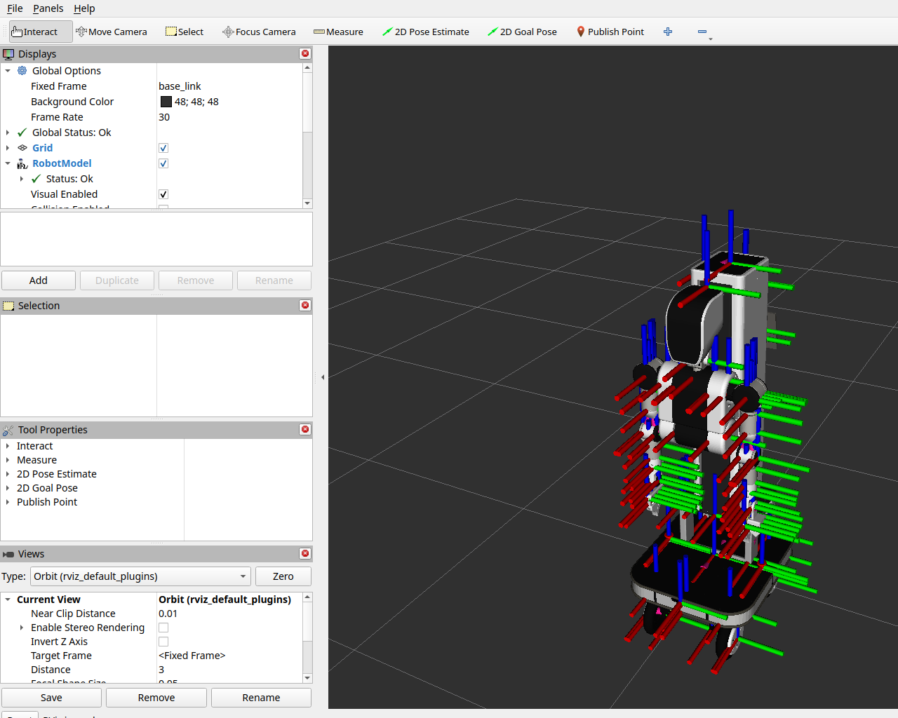

# AGIRobots Worker Description

AGIRobots Worker の **URDF モデル、メッシュ、RViz2 可視化設定** を提供するパッケージです。

## 検証結果

- `check_urdf` で読み込み確認済み
- URDF から参照されるメッシュ 122 個の存在を確認済み
- 可動関節は 38、固定関節は 84
- `ros2 launch agirobots_worker_description display.launch.py use_gui:=false` で `robot_state_publisher` と `rviz2` の起動を確認済み

## 構造プレビュー

RViz2 で描画確認したプレビューです。



URDF から生成したリンク・ジョイント構造図です。


## 使い方

```bash
cd ~/ros2_ws
colcon build --packages-select agirobots_worker_description
source install/setup.bash
ros2 launch agirobots_worker_description display.launch.py
```

## ディレクトリ構成

```text
agirobots_worker_description/
├── launch/
├── meshes/
├── rviz/
└── urdf/
```

## 補足

このパッケージは可視化と構造確認を目的としています。実機制御やシミュレーション制御は含みません。
